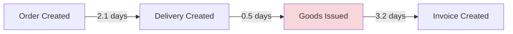

# SAP Workflow Mining

> Extract process mining insights from SAP ECC 6.0 without S/4HANA migration

**Zero risk** - Read-only access, no data modification
**Zero cost** - Open source, MIT license
**Zero migration** - Works with your existing ECC system
**Fast time to value** - Hours to first insights, not months

[](https://github.com/chrbailey/sap-workflow-mining/actions/workflows/ci.yml)
[](https://codecov.io/gh/chrbailey/sap-workflow-mining)
[](https://github.com/chrbailey/sap-workflow-mining/actions/workflows/release.yml)
[](https://github.com/chrbailey/sap-workflow-mining/releases/latest)
[](https://opensource.org/licenses/MIT)
[](https://nodejs.org/)
[](https://www.python.org/)
[](https://github.com/chrbailey/sap-workflow-mining/actions/workflows/ci.yml)
[](https://prettier.io/)
[](https://eslint.org/)

---

## 🚀 What's New in v2.0

| Feature | Description |
|---------|-------------|
| 🗣️ **Natural Language Interface** | Ask questions in plain English - "Why are orders delayed?" |
| 📊 **OCEL 2.0 Export** | Object-centric event logs for PM4Py, Celonis |
| ✅ **Conformance Checking** | Compare processes against O2C/P2P reference models |
| 🗺️ **Visual Process Maps** | Mermaid/GraphViz diagrams with bottleneck highlighting |
| 🔮 **Predictive Monitoring** | ML-based late delivery, credit hold, completion time predictions |

**[View Release Notes →](https://github.com/chrbailey/sap-workflow-mining/releases/tag/v2.0.0)**

---

## 60-Second Quickstart

Choose your path:

### Option A: Demo Mode (No SAP Required)
```bash
# Generate synthetic SAP data, run analysis, view results
docker-compose up --build

# Open browser to http://localhost:8080
```

### Option B: Analyze Your CSV Exports
```bash
# Export from SE16: VBAK, VBAP, LIKP, LIPS, VBRK, VBRP, STXH/STXL
# Place files in ./input-data/
docker-compose run pattern-engine --input-dir /app/input-data --output-dir /app/output
```

### Option C: Live RFC Connection
```bash
# Copy and edit configuration
cp .env.rfc.example .env.rfc
# Edit .env.rfc with your SAP connection details

# Run with RFC adapter
docker-compose --profile rfc up mcp-server-rfc
```

See [Installation Guide](docs/adapter_guide.md) for detailed setup instructions.

---

## What You Get

```
+-----------------------------------------------------------------------------------+
|                              Pattern Discovery Report                              |
+-----------------------------------------------------------------------------------+
| Pattern: "Credit Hold Escalation"                                                  |
| ----------------------------------------------------------------------------------|
| Finding: Orders with 'CREDIT HOLD' in notes have 3.2x longer fulfillment cycles   |
|                                                                                    |
| Occurrence: 234 orders (4.7% of dataset)                                           |
| Sales Orgs: 1000 (64%), 2000 (36%)                                                 |
| Confidence: HIGH (p < 0.001)                                                       |
|                                                                                    |
| Caveat: Correlation only - does not imply causation                                |
+-----------------------------------------------------------------------------------+
```

**Key Features:**
- **Text Pattern Discovery** - Find hidden patterns in order notes, rejection reasons, and delivery instructions
- **Document Flow Analysis** - Trace complete order-to-cash chains with timing at each step
- **Outcome Correlation** - Identify text patterns that correlate with delays, partial shipments, or returns
- **Evidence-Based Reporting** - Every pattern links to specific documents for verification
- **Privacy-First Design** - PII redaction enabled by default, shareable output mode for external review

---

## v2.0 Features

### Natural Language Interface

Ask questions about your SAP processes in plain English:

```
User: "Why are orders from sales org 1000 taking longer to ship?"

System: Based on analysis of 5,234 orders:
- Average delay: 4.2 days vs 1.8 days for other orgs
- Root cause: 73% have "CREDIT HOLD" in notes
- Recommendation: Review credit check thresholds for org 1000

Confidence: HIGH | Evidence: 847 documents analyzed
```

Supports multiple LLM providers:
- **Ollama** (local, private) - Default for air-gapped environments
- **OpenAI** (GPT-4) - For cloud deployments
- **Anthropic** (Claude) - Alternative cloud option

### OCEL 2.0 Export

Export to the [Object-Centric Event Log](https://www.ocel-standard.org/) standard for advanced process mining:

```json
{
  "ocel:version": "2.0",
  "ocel:objectTypes": ["order", "item", "delivery", "invoice"],
  "ocel:events": [...],
  "ocel:objects": [...]
}
```

- Captures multi-object relationships (order → items → deliveries → invoices)
- Compatible with PM4Py, Celonis, and other OCEL tools
- Export formats: JSON, XML, SQLite

### Conformance Checking

Compare actual SAP processes against expected Order-to-Cash models:

```
Conformance Report: 94.2% (4,712 / 5,000 cases)

Deviations Detected:
├── CRITICAL: Invoice before Goods Issue (23 cases)
├── MAJOR: Skipped Delivery step (187 cases)
└── MINOR: Duplicate Order Created (78 cases)
```

- Pre-built O2C reference models (simple and detailed)
- Severity scoring: Critical / Major / Minor
- Deviation types: skipped steps, wrong order, missing activities

### Visual Process Maps

Generate process flow diagrams with bottleneck highlighting:



- Output formats: Mermaid (Markdown), GraphViz (DOT), SVG
- Color-coded bottleneck severity (green/yellow/red)
- Timing annotations between process steps

### Predictive Monitoring

ML-based prediction for process outcomes:

```
Order 0000012345 - Risk Assessment:
├── Late Delivery: 78% probability (HIGH RISK)
│   └── Factors: credit_block, order_value > $50k
├── Credit Hold: 45% probability (MEDIUM RISK)
└── Est. Completion: 8.2 days
```

**Prediction Types:**
- **Late Delivery** - Probability based on case age, progress, stalls, rework
- **Credit Hold** - Likelihood based on credit check status, complexity
- **Completion Time** - Estimated hours remaining based on progress/pace

**29 Extracted Features:**
- Temporal: case age, time since last event, avg time between events
- Activity: milestones reached, rework detection, loop count, backtracks
- Resource: unique resources, handoff count
- Risk indicators: stalled cases, credit holds, rejections, blocks

**Risk Scoring:**
- 🟢 Low (0-25%) | 🟡 Medium (25-50%) | 🟠 High (50-75%) | 🔴 Critical (75-100%)
- Configurable alert thresholds
- Actionable recommendations based on detected risk factors

---

## Why This Instead of S/4HANA?

| Consideration | S/4HANA Migration | SAP Workflow Mining |
|--------------|-------------------|---------------------|
| **Timeline** | 18-36 months | Hours to first insights |
| **Cost** | $10M-$100M+ | Free (MIT license) |
| **Risk** | Business disruption | Zero - read-only access |
| **Data Location** | Cloud/hosted | On-premise only |
| **Prerequisites** | Greenfield/brownfield project | Works with existing ECC 6.0 |
| **Process Visibility** | After migration | Before any changes |
| **Use Case** | Full transformation | Process discovery & optimization |

**This tool does not replace S/4HANA.** It helps you understand your current processes *before* making migration decisions - or find optimization opportunities in your existing ECC system.

---

## Installation

### Prerequisites
- Docker & Docker Compose (recommended)
- OR Node.js 18+ and Python 3.10+ for local development

### Quick Install
```bash
git clone https://github.com/your-org/sap-workflow-mining.git
cd sap-workflow-mining
docker-compose up --build
```

### Detailed Setup
See [docs/adapter_guide.md](docs/adapter_guide.md) for:
- RFC adapter configuration for ECC 6.0
- OData adapter configuration for S/4HANA
- CSV import from SE16 exports
- Air-gapped installation options

### LLM Configuration (v2.0)

Configure the natural language interface in `.env`:

```bash
# Option 1: Local Ollama (default, private)
LLM_PROVIDER=ollama
OLLAMA_HOST=http://localhost:11434
LLM_MODEL=llama3

# Option 2: OpenAI
LLM_PROVIDER=openai
LLM_API_KEY=sk-...
LLM_MODEL=gpt-4

# Option 3: Anthropic
LLM_PROVIDER=anthropic
LLM_API_KEY=sk-ant-...
LLM_MODEL=claude-3-sonnet-20240229
```

For air-gapped environments, use Ollama with locally downloaded models.

---

## Demos

Interactive demos for all v2.0 process mining tools. No SAP connection required - all demos use synthetic data.

```bash
cd mcp-server

# Natural Language Interface - ask questions in plain English
npx tsx ../demos/ask_process_demo.ts
npx tsx ../demos/ask_process_demo.ts --interactive  # Interactive mode

# OCEL 2.0 Export - export to process mining standard format
npx tsx ../demos/export_ocel_demo.ts

# Conformance Checking - compare against O2C reference model
npx tsx ../demos/check_conformance_demo.ts

# Visual Process Maps - generate Mermaid flowcharts
npx tsx ../demos/visualize_process_demo.ts

# Predictive Monitoring - ML-based risk predictions
npx tsx ../demos/predict_outcome_demo.ts
```

| Demo | Description |
|------|-------------|
| `ask_process_demo.ts` | Natural language queries with LLM integration |
| `export_ocel_demo.ts` | OCEL 2.0 export with object/event breakdown |
| `check_conformance_demo.ts` | Deviation detection and severity scoring |
| `visualize_process_demo.ts` | Mermaid diagrams with bottleneck highlighting |
| `predict_outcome_demo.ts` | Risk predictions and alerts |
| `salt_adapter_demo.ts` | Real SAP O2C data from SALT dataset |
| `visualize_process_bpi_demo.ts` | Process maps with real P2P data (BPI 2019) |
| `predict_outcome_bpi_demo.ts` | Risk predictions with real P2P data (BPI 2019) |
| `ask_process_bpi_demo.ts` | Natural language queries on P2P data |

---

## Real SAP Data

### BPI Challenge 2019 (P2P)

Use real SAP Purchase-to-Pay data from the [BPI Challenge 2019](https://data.4tu.nl/articles/dataset/BPI_Challenge_2019/12715853) for testing with authentic business patterns.

```bash
# Download and convert BPI 2019 data
python scripts/download_bpi_2019.py

# Run demos with real P2P data
npx tsx demos/visualize_process_bpi_demo.ts 50
npx tsx demos/predict_outcome_bpi_demo.ts 30
npx tsx demos/ask_process_bpi_demo.ts
```

**Dataset Statistics:**
| Metric | Value |
|--------|-------|
| Total cases | 251,734 |
| Total events | 1.5M+ |
| Unique activities | 39 |
| Process type | Purchase-to-Pay (P2P) |
| Source | Multinational coatings company |

**Activities include:** SRM workflows, Purchase Orders, Goods Receipts, Service Entries, Invoice Processing, Vendor interactions

---

### SALT Dataset (O2C)

Use real SAP ERP data from SAP's [SALT dataset](https://huggingface.co/datasets/SAP/SALT) on HuggingFace for testing with authentic business patterns.

### Quick Start

```bash
# 1. Install Python dependencies
pip install datasets pyarrow

# 2. Download SALT dataset
python scripts/download-salt.py

# 3. Run demo with real data
cd mcp-server
npx tsx ../demos/salt_adapter_demo.ts
```

### What's Included

SALT (Sales Autocompletion Linked Business Tables) contains:

| Table | Description | Records |
|-------|-------------|---------|
| I_SalesDocument | Sales order headers | ~1M+ |
| I_SalesDocumentItem | Order line items | ~5M+ |
| I_Customer | Customer master data | ~100K |
| I_AddrOrgNamePostalAddress | Address data | ~100K |

### Using the SALT Adapter

```typescript
import { SaltAdapter } from './adapters/salt/index.js';

const adapter = new SaltAdapter({
  maxDocuments: 10000,  // Limit for memory management
});

await adapter.initialize();

// Get real sales order data
const header = await adapter.getSalesDocHeader({ vbeln: '0000012345' });
const items = await adapter.getSalesDocItems({ vbeln: '0000012345' });

// Get dataset statistics
const stats = adapter.getStats();
console.log(`Loaded ${stats.salesDocuments} sales documents`);
```

### Limitations

SALT contains **sales orders only** (no deliveries or invoices). For full Order-to-Cash testing:
- Use SALT for sales order analysis and ML training
- Use synthetic adapter for complete O2C flow testing
- Combine both for comprehensive validation

### Why Use Real Data?

| Aspect | Synthetic Data | SALT Real Data |
|--------|---------------|----------------|
| Patterns | Random/artificial | Authentic business patterns |
| ML Training | Limited accuracy | Real-world feature distributions |
| Demos | Good for UI testing | Compelling for stakeholders |
| Validation | Functional testing | Business logic validation |

---

## Security & Compliance

**This system is designed for enterprise security requirements.**

| Concern | How We Address It |
|---------|-------------------|
| **Data Access** | Read-only BAPIs only - no write operations, no arbitrary SQL |
| **Data Location** | All processing is on-premise - no cloud, no external APIs |
| **Network** | No outbound connections, no telemetry, no phone-home |
| **PII Protection** | Automatic redaction of emails, phones, names, addresses |
| **Audit Trail** | Every query logged with parameters, timestamps, row counts |
| **Row Limits** | Default 200 rows per query, max 1000 - prevents bulk extraction |

**See [SECURITY.md](SECURITY.md) for complete security documentation.**

---

## For SAP Basis Administrators

### Required Authorizations

The RFC user requires **display-only** access to SD documents:

```
Authorization Object: S_RFC
  RFC_TYPE = FUGR
  RFC_NAME = STXR, 2001, 2051, 2056, 2074, 2077
  ACTVT = 16 (Execute)

Authorization Object: V_VBAK_VKO
  VKORG = [Your Sales Organizations]
  ACTVT = 03 (Display)

Authorization Object: V_VBAK_AAT
  AUART = * (or specific document types)
  ACTVT = 03 (Display)
```

**Copy-paste ready role template:** See [docs/SAP_AUTHORIZATION.md](docs/SAP_AUTHORIZATION.md)

### BAPIs Used (All Read-Only)

| BAPI | Purpose | Tables Accessed |
|------|---------|-----------------|
| `BAPI_SALESORDER_GETLIST` | List sales orders | VBAK |
| `SD_SALESDOCUMENT_READ` | Read order header/items | VBAK, VBAP |
| `BAPI_SALESDOCU_GETRELATIONS` | Document flow (VBFA) | VBFA |
| `BAPI_OUTB_DELIVERY_GET_DETAIL` | Delivery details | LIKP, LIPS |
| `BAPI_BILLINGDOC_GETDETAIL` | Invoice details | VBRK, VBRP |
| `READ_TEXT` | Long text fields | STXH, STXL |
| `BAPI_CUSTOMER_GETDETAIL2` | Customer master (stub) | KNA1 |
| `BAPI_MATERIAL_GET_DETAIL` | Material master (stub) | MARA |

No direct table access. No RFC_READ_TABLE unless explicitly enabled.

---

## Architecture

```
+------------------------------------------------------------------+
|                        Your Network                               |
|  +------------------------------------------------------------+  |
|  |                                                            |  |
|  |   +----------------+     +-------------------+             |  |
|  |   | SAP ECC 6.0    |     | SAP Workflow      |             |  |
|  |   |                |     | Mining Server     |             |  |
|  |   |  +----------+  |     |                   |             |  |
|  |   |  | SD/MM    |  | RFC |  +-------------+  |             |  |
|  |   |  | Tables   |<--------->| MCP Server  |  |             |  |
|  |   |  +----------+  | (R/O)|  +-------------+  |             |  |
|  |   |                |     |         |         |             |  |
|  |   +----------------+     |         v         |             |  |
|  |                          |  +-------------+  |             |  |
|  |                          |  | Pattern     |  |             |  |
|  |                          |  | Engine      |  |             |  |
|  |                          |  +-------------+  |             |  |
|  |                          |         |         |             |  |
|  |                          |         v         |             |  |
|  |   +----------------+     |  +-------------+  |             |  |
|  |   | Browser        |<------>| Web Viewer  |  |             |  |
|  |   | (localhost)    |     |  +-------------+  |             |  |
|  |   +----------------+     +-------------------+             |  |
|  |                                                            |  |
|  +------------------------------------------------------------+  |
|                                                                   |
|                    NO EXTERNAL CONNECTIONS                        |
+------------------------------------------------------------------+
```

**Data Flow:**
1. MCP Server connects to SAP via RFC (read-only BAPIs)
2. Pattern Engine analyzes text fields and document flows
3. Results stored locally with PII redacted
4. Web Viewer displays findings on localhost

**Nothing leaves your network.**

---

## FAQ

### Is this tool officially supported by SAP?

No. This is an independent open-source project. It uses standard SAP BAPIs that are publicly documented.

### Will this impact SAP system performance?

Minimal impact. All queries are:
- Read-only (no locks)
- Row-limited (200 default, 1000 max)
- Rate-limited (configurable)
- Use standard BAPIs (not direct table access)

We recommend running initial analysis during off-peak hours.

### What SAP modules are supported?

Currently SD (Sales & Distribution) and MM (Materials Management) document flows. FI/CO integration is planned for future releases.

### Does this work with SAP on any database?

Yes. The tool uses BAPIs which are database-agnostic. Works with HANA, Oracle, DB2, SQL Server, MaxDB.

### Can I run this in an air-gapped environment?

Yes. The Docker images can be built offline and transferred. No external dependencies at runtime.

### How do I validate the findings?

Every pattern card includes:
- Sample document numbers for verification in SAP (VA03, VL03N, VF03)
- Statistical confidence intervals
- Explicit caveats about correlation vs. causation

### What about GDPR/data protection?

- PII redaction is enabled by default
- No data leaves your network
- Shareable mode applies additional redaction
- See [SECURITY.md](SECURITY.md) for compliance considerations

### Can I contribute or request features?

Yes. See [CONTRIBUTING.md](CONTRIBUTING.md) for guidelines. Feature requests via GitHub Issues.

---

## Governance (PromptSpeak Integration)

The MCP server includes a governance layer based on **PromptSpeak symbolic frames** for pre-execution blocking and human-in-the-loop approval workflows.

### Why Governance?

When AI agents access SAP data, you need controls to:
- **Prevent bulk extraction** - Hold requests for large date ranges or row counts
- **Protect sensitive data** - Require approval for searches containing PII patterns
- **Halt rogue agents** - Circuit breaker to immediately stop misbehaving agents
- **Audit everything** - Complete trail of all operations for compliance

### PromptSpeak Frames

Every operation has a symbolic frame indicating mode, domain, action, and entity:

```
Frame: ⊕◐◀α
       │ │ │ └── Entity: α (primary agent)
       │ │ └──── Action: ◀ (retrieve)
       │ └────── Domain: ◐ (operational)
       └──────── Mode: ⊕ (strict)
```

| Symbol | Category | Meaning |
|--------|----------|---------|
| `⊕` | Mode | Strict - exact compliance required |
| `⊘` | Mode | Neutral - standard operation |
| `⊖` | Mode | Flexible - allow interpretation |
| `⊗` | Mode | **Forbidden** - blocks all actions |
| `◊` | Domain | Financial (invoices, values) |
| `◐` | Domain | Operational (orders, deliveries) |
| `◀` | Action | Retrieve data |
| `▲` | Action | Analyze/search |
| `●` | Action | Validate |
| `α` `β` `γ` | Entity | Primary/secondary/tertiary agent |

### Hold Triggers

Operations are automatically held for human approval when:

| Trigger | Threshold | Example |
|---------|-----------|---------|
| Broad date range | >90 days | `date_from: 2024-01-01, date_to: 2024-12-31` |
| High row limit | >500 rows | `limit: 1000` |
| Sensitive patterns | SSN, credit card, password | `pattern: "social security"` |

### Governance Workflow

```
Agent Request
     │
     ▼
┌─────────────┐     ┌─────────────┐
│ Circuit     │────▶│ BLOCKED     │ (if agent halted)
│ Breaker     │     └─────────────┘
└─────────────┘
     │ OK
     ▼
┌─────────────┐     ┌─────────────┐
│ Frame       │────▶│ BLOCKED     │ (if ⊗ forbidden)
│ Validation  │     └─────────────┘
└─────────────┘
     │ OK
     ▼
┌─────────────┐     ┌─────────────┐     ┌─────────────┐
│ Hold        │────▶│ HELD        │────▶│ Human       │
│ Check       │     │ (pending)   │     │ Approval    │
└─────────────┘     └─────────────┘     └─────────────┘
     │ OK                                      │
     ▼                                         ▼
┌─────────────┐                         ┌─────────────┐
│ EXECUTE     │◀────────────────────────│ APPROVED    │
└─────────────┘                         └─────────────┘
```

### Governance Tools

| Tool | Purpose |
|------|---------|
| `ps_precheck` | Dry-run: check if operation would be allowed |
| `ps_list_holds` | List pending holds awaiting approval |
| `ps_approve_hold` | Approve a held operation |
| `ps_reject_hold` | Reject a held operation with reason |
| `ps_agent_status` | Check circuit breaker state for an agent |
| `ps_halt_agent` | Immediately halt an agent (blocks all ops) |
| `ps_resume_agent` | Resume a halted agent |
| `ps_stats` | Get governance statistics |
| `ps_frame_docs` | Get PromptSpeak frame reference |

### Example: Hold and Approval Flow

```typescript
// 1. Agent makes a request that triggers hold
const result = await mcp.callTool('search_doc_text', {
  pattern: 'delivery',
  date_from: '2024-01-01',
  date_to: '2024-12-31',  // >90 days triggers hold
});
// Returns: { held: true, hold_id: 'hold_abc123', reason: 'broad_date_range' }

// 2. Supervisor reviews pending holds
const holds = await mcp.callTool('ps_list_holds', {});
// Returns: [{ holdId: 'hold_abc123', tool: 'search_doc_text', severity: 'medium' }]

// 3. Supervisor approves
const approved = await mcp.callTool('ps_approve_hold', {
  hold_id: 'hold_abc123',
  approved_by: 'supervisor@example.com'
});
// Returns: { allowed: true, auditId: 'audit_xyz789' }
```

### Example: Emergency Agent Halt

```typescript
// Immediately block a misbehaving agent
await mcp.callTool('ps_halt_agent', {
  agent_id: 'agent-123',
  reason: 'Excessive query rate detected'
});

// All subsequent requests from this agent are blocked
const result = await mcp.callTool('get_doc_text', {
  doc_type: 'order',
  doc_key: '0000000001',
  _agent_id: 'agent-123'  // Identifies the agent
});
// Returns: { error: 'Governance Blocked', message: 'Agent halted: Excessive query rate' }

// Resume when issue is resolved
await mcp.callTool('ps_resume_agent', { agent_id: 'agent-123' });
```

---

## MCP Tools Reference

### SAP Data Tools

| Tool | Purpose | Returns |
|------|---------|---------|
| `search_doc_text` | Find documents by text pattern | doc_type, doc_key, snippet, match_score |
| `get_doc_text` | Get all text fields for a document | header_texts[], item_texts[] |
| `get_doc_flow` | Get order-delivery-invoice chain | chain with keys, statuses, dates |
| `get_sales_doc_header` | Order header details | sales_org, customer, dates, values |
| `get_sales_doc_items` | Order line items | materials, quantities, values |
| `get_delivery_timing` | Requested vs actual delivery | timestamps, variance analysis |
| `get_invoice_timing` | Invoice creation/posting | invoice dates, accounting refs |
| `get_master_stub` | Safe master data attributes | hashed IDs, categories (no PII) |

### Process Mining Tools (v2.0)

| Tool | Purpose | Returns |
|------|---------|---------|
| `ask_process` | Natural language queries | answer, confidence, evidence, recommendations |
| `export_ocel` | Export to OCEL 2.0 format | OCEL JSON/XML with objects and events |
| `check_conformance` | Compare against O2C model | conformance_rate, deviations, severity_summary |
| `visualize_process` | Generate process diagrams | Mermaid/DOT/SVG with bottleneck highlighting |
| `predict_outcome` | ML-based outcome prediction | predictions, alerts, risk_levels, factors |

### Governance Tools

| Tool | Purpose | Returns |
|------|---------|---------|
| `ps_precheck` | Check if operation would be allowed | wouldAllow, wouldHold, reason |
| `ps_list_holds` | List pending holds | Array of hold requests |
| `ps_approve_hold` | Approve a held operation | Execution result with auditId |
| `ps_reject_hold` | Reject a held operation | Success boolean |
| `ps_agent_status` | Get agent circuit breaker state | isAllowed, state, haltReason |
| `ps_halt_agent` | Halt an agent immediately | halted, agent_id |
| `ps_resume_agent` | Resume a halted agent | resumed, agent_id |
| `ps_stats` | Get governance statistics | holds, haltedAgents, auditEntries |
| `ps_frame_docs` | Get PromptSpeak documentation | Frame format reference |

---

## License

MIT License - See [LICENSE](LICENSE)

This is enterprise-friendly open source:
- Use commercially without restriction
- Modify and distribute freely
- No copyleft obligations
- No warranty (provided as-is)

---

## Support

- **Documentation**: [docs/](docs/)
- **Issues**: GitHub Issues
- **Security**: See [SECURITY.md](SECURITY.md) for vulnerability reporting

---

## Disclaimer

This tool is provided as-is for process analysis purposes. It does not modify SAP data. Users are responsible for:
- Ensuring compliance with organizational data access policies
- Validating findings before making business decisions
- Proper configuration of SAP authorizations

**Correlation does not imply causation.** All pattern findings should be verified against actual business processes.


